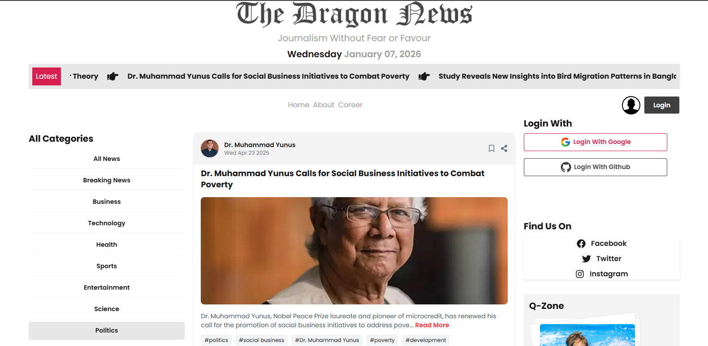
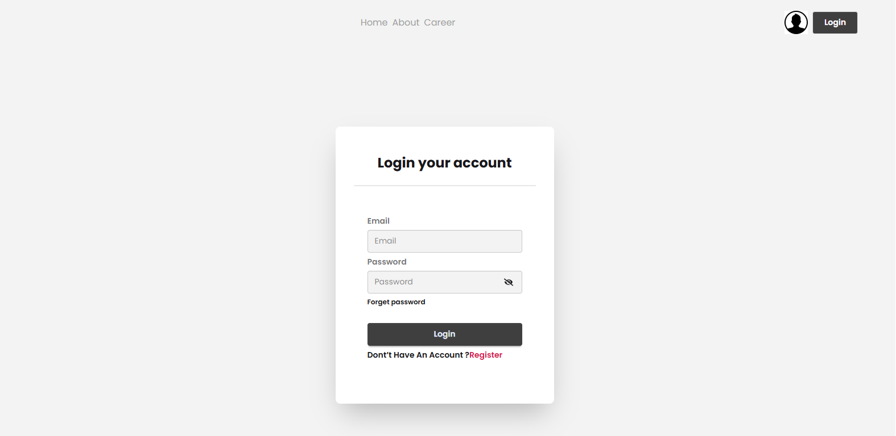
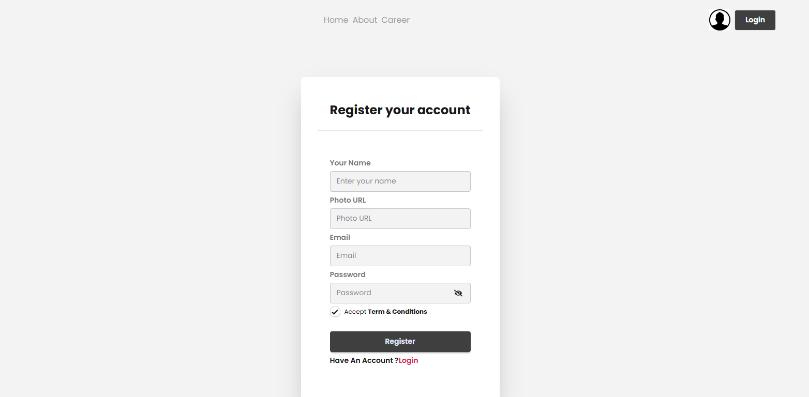

# 📰 News Portal Web Application

This is a modern **News Portal Web Application** designed and developed using React.  
Users can browse news by category, view news cards, and read full news details on a separate page.  
The application focuses on a clean, responsive UI and smooth user experience.

---

## 🔗 Live Demo
👉 https://the-dragon-news-b022c.web.app/

## 📂 Repository Link
👉 https://github.com/sojib6505/the-dragon-news

---

## ✨ Features & Implementations
- Category-wise dynamic news filtering
- Reusable **NewsCard** component
- Dynamic **News Details Page** using React Router
- Data fetching using **Axios** (API / JSON)
- **Firebase Authentication** (Login & Logout)
- Loader / Spinner for handling loading states
- Single Page Application (SPA) navigation
- Fully responsive design (Mobile, Tablet, Desktop)
- Modern UI built with **Tailwind CSS** and **DaisyUI**

---

## 🛠️ Technologies Used
- **React.js** – Frontend library
- **Tailwind CSS** – Utility-first CSS framework
- **DaisyUI** – Tailwind-based UI components
- **React Router** – Client-side routing
- **Axios** – Data fetching
- **Firebase Authentication** – User authentication
- **React Icons** – Icon library
- **Loader / Spinner** – Loading state handling
- **JSON / API Data** – News content management

---

## 📸 Screenshots
### Home Page

### News Details Page

### Authentication Page

### Mobile Device Page

---

## 🎯 Purpose of This Project
This project was built to:
- Practice frontend development with React
- Learn component-based architecture
- Understand React Router and dynamic routing
- Work with API / JSON data in a real-world project
- Showcase skills in my personal portfolio

---

## 👨‍💻 Author
**Sojib Islam**  
Frontend Web Developer  
📧 Email: sojib6505@gmail.com

---

## 📜 License
This project is open-source and free to use for learning purposes.

⭐ If you like this project, please consider giving it a **star**!
